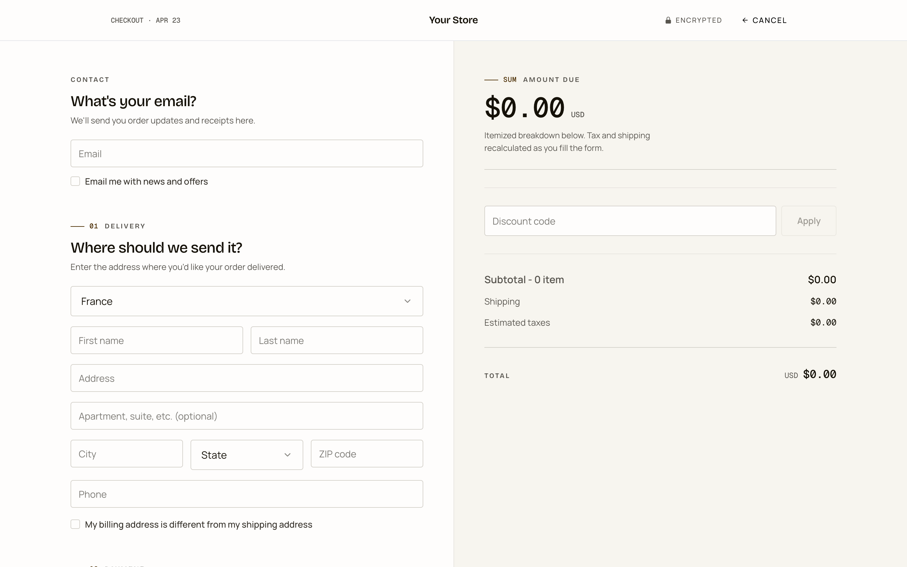
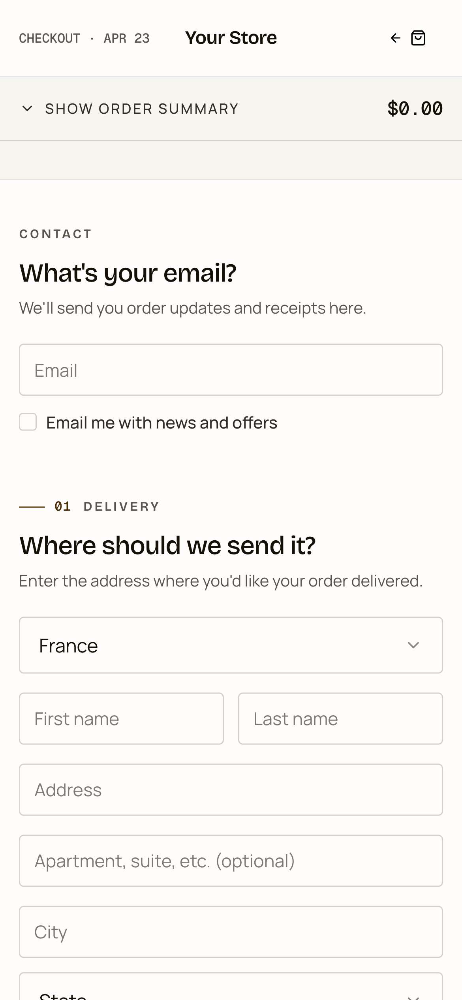
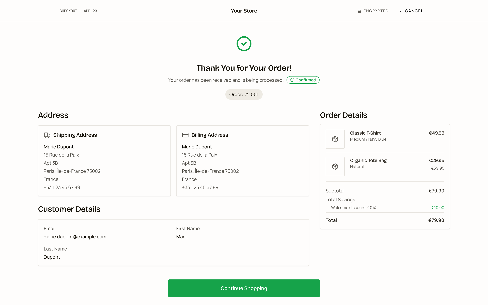
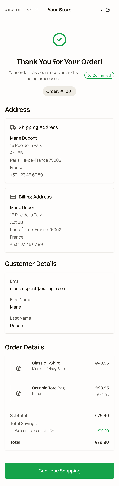

# Simple Checkout — Editorial Style

A minimal, production-ready TagadaPay checkout plugin with a deliberate
**editorial / Swiss-modern** aesthetic. Extracted from the production
`native-checkout` template, it keeps the exact same `@tagadapay/plugin-sdk`
v2 hook-level behavior and is intended as a **reference implementation** for
integrators.

> One page. One column of content. All the SDK surface you need to build a
> working checkout.

---

## Showcase

<table>
  <thead>
    <tr>
      <th align="center">Desktop · 1440 × 900</th>
      <th align="center">Mobile · 390 × 844</th>
    </tr>
  </thead>
  <tbody>
    <tr>
      <td align="center" valign="top">
        
        <br/><sub>Checkout</sub>
      </td>
      <td align="center" valign="top">
        
        <br/><sub>Checkout</sub>
      </td>
    </tr>
    <tr>
      <td align="center" valign="top">
        
        <br/><sub>Thank-you · full page</sub>
      </td>
      <td align="center" valign="top">
        
        <br/><sub>Thank-you · full page</sub>
      </td>
    </tr>
  </tbody>
</table>

> Clean empty-state render with the default configuration — no theming applied.
> Run `pnpm dev` locally to see the full interactive experience.

---

## What this plugin is (and is not)

**Is:**

- A single `SingleStepCheckout` page using production-grade SDK hooks
  (`useCheckout`, `usePayment`, `useShippingRates`, `useFunnel`,
  `useApplePayCheckout`, `useGooglePayCheckout`, `usePluginConfig`,
  `useTranslation`, `useISOData`, `usePixelTracking`, `useTagadaContext`,
  `useStepConfig`).
- A working visual system: Bricolage Grotesque (display) + Manrope (body) +
  Geist Mono (numerics), hairline 1px borders, 4px radius, tabular-nums on
  every price, an OKLCH olive-bronze brand palette tinted into all neutrals
  for subconscious cohesion.
- A showcase of what you get when you refuse the AI-default checkout look
  (no rounded-lg card stack, no indigo gradient on the CTA, no soft drop
  shadows, no Inter).

**Is not:**

- A funnel. No upsells, no post-purchase, no club, no portal. Just checkout.

---

## Aesthetic direction

The style intentionally breaks away from the contemporary fintech default
(Stripe indigo / Linear gray / rounded shadowed cards). The three anchors:

| Layer          | Choice                                                                          |
| -------------- | ------------------------------------------------------------------------------- |
| Typography     | **Bricolage Grotesque** display, **Manrope** body, **Geist Mono** for prices    |
| Color          | **OKLCH olive-bronze** brand (`hue 85`), all neutrals tinted toward it           |
| Composition    | Hairline 1px dividers, no drop shadows, **4px** radius, editorial step markers  |
| Numerics       | Tabular lining figures everywhere — because invoices must line up               |
| Motion         | 100ms linear, no bounce, no scale, no glow                                      |

Full design notes are in [`.impeccable.md`](./.impeccable.md) at the root of
this plugin (generated from the [impeccable](https://github.com/pbakaus/impeccable)
design methodology).

---

## Project layout

```
simple-checkout-style-editorial/
├── plugin.manifest.json       # Plugin metadata + routing
├── config/                    # Default config + JSON schema + UI schema
│   └── default.config.json    # Brand colors, summary, header, shipping, etc.
├── src/
│   ├── App.tsx                # Router: /checkout + /thankyou
│   ├── main.tsx
│   ├── index.css              # OKLCH tokens, type scale, tabular-nums utilities
│   ├── pages/
│   │   └── CheckoutPage.tsx   # Reads checkoutToken → renders <SingleStepCheckout/>
│   ├── components/
│   │   ├── SingleStepCheckout.tsx   # ⭐ The page — start here
│   │   ├── AddressSection.tsx
│   │   ├── OrderSummary.tsx          # Hero "amount due" + itemized invoice
│   │   ├── PaymentSection.tsx
│   │   ├── ShippingRates.tsx
│   │   ├── TopBar.tsx                # Editorial masthead
│   │   ├── ThemeSetter.tsx           # Wires merchant config into OKLCH tokens
│   │   ├── OrderBump.tsx
│   │   ├── ExpressCheckoutButtons.tsx
│   │   └── ...                       # APM components (HiPay, Zelle, Whop, Custom)
│   ├── contexts/              # PaymentMethods / GeoLocation / VipOffers / StoreConfig
│   ├── hooks/                 # useIsTablet, useIsThreedsActive, usePageMetadata, useTheme
│   ├── lib/                   # checkout-schema (zod), utils
│   └── types/                 # plugin-config, payment-type, card-network
└── README.md
```

---

## Getting started

```bash
pnpm install
pnpm dev            # opens http://localhost:5173/checkout
```

Pass a checkout token via query string to hydrate a real session:

```
http://localhost:5173/checkout?checkoutToken=<TAGADA_CHECKOUT_TOKEN>
```

---

## Build & deploy

```bash
pnpm build
pnpm deploy          # or deploy:dev / deploy:staging / deploy:prod
```

---

## Where to look first

If you're integrating the TagadaPay plugin SDK, read the files below in
order — they cover 90% of the hook surface:

1. **`src/pages/CheckoutPage.tsx`** — resolving the checkout token from URL
   or funnel context.
2. **`src/components/SingleStepCheckout.tsx`** — the single source of truth
   for:
   - `useCheckout` (session + mutations)
   - `usePayment` (card + APM, with universal `onPaymentCompleted` /
     `onPaymentFailed`)
   - `useShippingRates` (preview → auto-select → refetch on address change)
   - `useApplePayCheckout` / `useGooglePayCheckout`
   - `useFunnel.next(...)` with `waitForSession` after 3DS redirect returns
   - Provider-specific handoffs: Whop, HiPay, Zelle, Custom, Klarna, PayPal,
     Bridge, OceanPayment, Crypto, APM (Stripe / Airwallex)
3. **`src/components/Providers.tsx`** — wrap your app in `<TagadaProvider/>`.
4. **`src/index.css`** + **`src/components/ThemeSetter.tsx`** — how the
   OKLCH design tokens are defined and how merchant branding is layered on
   top at runtime.

---

## Customizing the style

Merchant colors are merged over the baseline palette at runtime via
`ThemeSetter`. If no merchant color is set, the OKLCH olive-bronze defaults
in `src/index.css` take over. Edit the `--brand-hue` and `--brand-chroma`
variables there to shift the whole system while preserving its internal
cohesion:

```css
:root {
  --brand-hue: 85;     /* 85 = olive-bronze. Try 25 (rust), 185 (teal), 265 (indigo). */
  --brand-chroma: 0.10;
}
```

All neutrals (`--ink-*`, `--line*`, `--surface*`) inherit a fraction of this
chroma, so a single hue change propagates harmoniously through the entire
UI.

---

## License

MIT — see the parent repository root for the license file.
