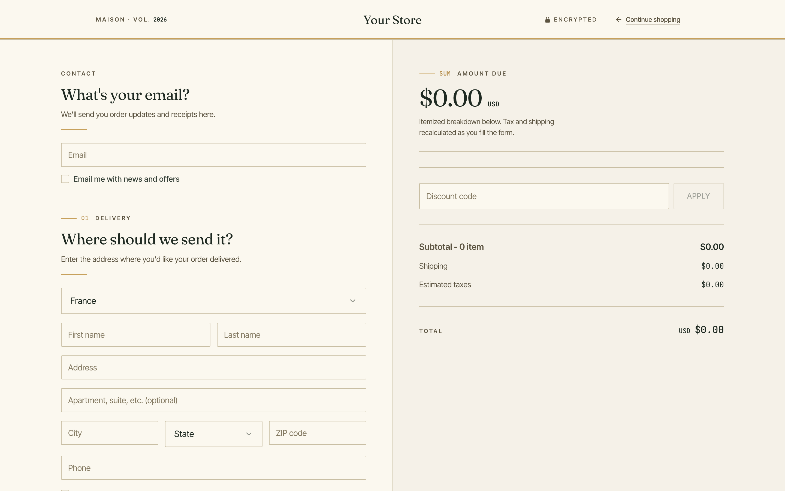
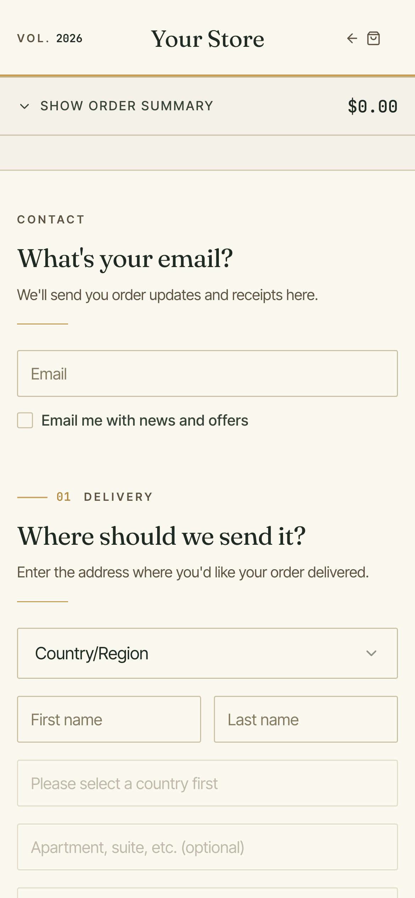
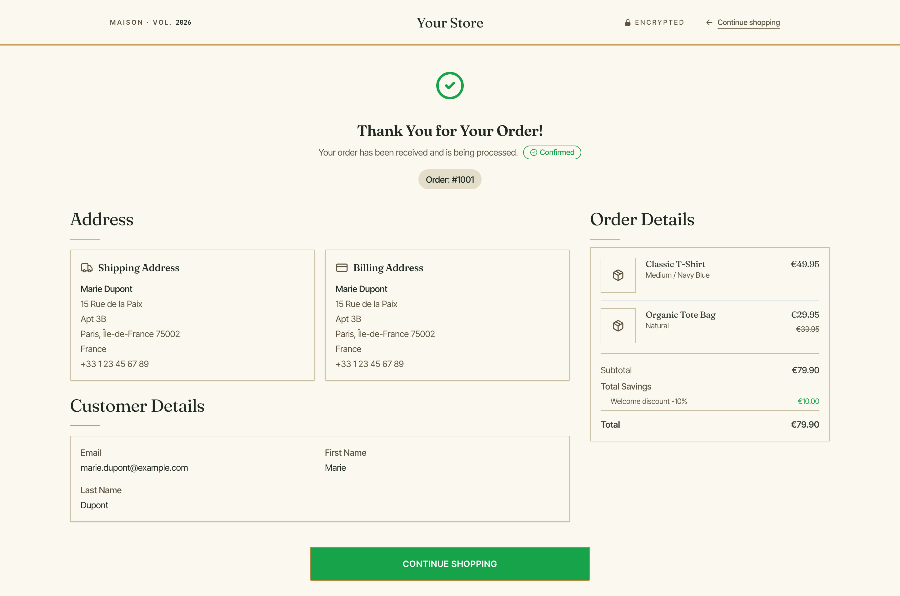
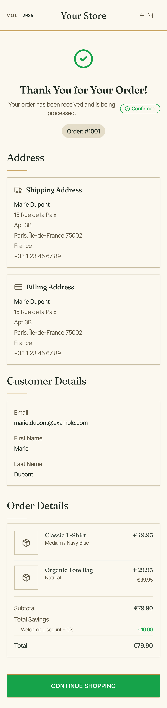

# Simple Checkout — Luxe / Boutique Style

A minimal, production-ready TagadaPay checkout plugin with a
**boutique / atelier** aesthetic. Built for leather goods,
fragrance, luxury skincare, fashion houses, and any commerce
brand whose identity is confident, quiet, and considered.

> **Sibling of** [`simple-checkout-style-editorial`](../simple-checkout-style-editorial),
> [`simple-checkout-style-neon`](../simple-checkout-style-neon).
> Same SDK hooks, same behavior — different brand world.
> Where neon shouts and editorial states, Luxe whispers.

Every variant shares the exact same `@tagadapay/plugin-sdk` v2
hook surface (`useCheckout`, `usePayment`, `useShippingRates`,
`useFunnel`, `useApplePayCheckout`, `useGooglePayCheckout`).
Only the visual system differs — that's the entire point:
**one codebase, many brand worlds**.

---

## Showcase

<table>
  <thead>
    <tr>
      <th align="center">Desktop · 1440 × 900</th>
      <th align="center">Mobile · 390 × 844</th>
    </tr>
  </thead>
  <tbody>
    <tr>
      <td align="center" valign="top">
        
        <br/><sub>Checkout</sub>
      </td>
      <td align="center" valign="top">
        
        <br/><sub>Checkout</sub>
      </td>
    </tr>
    <tr>
      <td align="center" valign="top">
        
        <br/><sub>Thank-you · full page</sub>
      </td>
      <td align="center" valign="top">
        
        <br/><sub>Thank-you · full page</sub>
      </td>
    </tr>
  </tbody>
</table>

> Clean empty-state render with the default configuration — no theming applied.
> Run `pnpm dev` locally to see the full interactive experience.

---

## Aesthetic direction

Boutique / atelier. Inspired by:

- Hermès (orange-as-restraint, heavy cardstock, hand-written tags)
- Aesop (apothecary labels, quiet grids)
- Loro Piana (catalog restraint)
- Le Labo (serif display + sans body, no exclamation marks)

The system in one line: **forest-green ink on warm cream, a single
aged-gold accent, 1px hairline borders, 2px radius, Fraunces display
serif, no drop shadows, no bounce, no neon.**

### Three-color palette

| Role         | Color     | Usage                                             |
| ------------ | --------- | ------------------------------------------------- |
| Ink          | `#1F2A22` | Every title, body text, every frame (forest)      |
| Surface      | `#F5F1E8` | Page background (warm cream)                      |
| Paper        | `#FBF8EF` | Card surface (slightly lighter cream)             |
| Accent       | `#C7A15C` | CTA, selected rows, step markers (aged gold)      |
| Line         | `#C9BFA4` | All hairline borders (warm bronze)                |

### Typography

| Role    | Font              | Weight              |
| ------- | ----------------- | ------------------- |
| Display | Fraunces (opsz)   | 400 / 500 (serif)   |
| Body    | Inter Tight       | 400 / 500 / 600     |
| Prices  | JetBrains Mono    | 400 / 500 / 600     |

Display serif sets every tone. Body stays silent. Numbers are always
in JetBrains Mono with tabular lining figures — receipts line up.

### Signature details

- **CTA**: forest-green label on aged-gold fill, 2px radius, 1px
  hairline border, no shadow. Hover darkens the gold one step and
  opens the letter-spacing slightly — like a clasp pressing shut.
- **Step markers**: small-caps eyebrow (`⸻  01`) in bronze + gold
  mono number. No filled circles, no pills.
- **Section titles**: display-serif in forest-green with a 48px
  gold hairline rule underneath — the single ornament.
- **Top bar**: cream surface with a gold inset underline. Wordmark
  is centered, display-serif. No dark band, no ticker.
- **Motion**: 160ms transitions, no bounce. Hover opens
  letter-spacing; that's the entire animation language.

---

## Project layout

```
simple-checkout-style-luxe/
├── plugin.manifest.json       # Plugin metadata + routing
├── STYLE.md                   # Full design manifesto
├── .impeccable.md             # Impeccable design context
├── config/
│   └── default.config.json    # Boutique defaults (gold / forest / cream)
├── src/
│   ├── App.tsx                # Router: /checkout + /thankyou
│   ├── main.tsx
│   ├── index.css              # ⭐ Tokens + boutique retrofit layer
│   ├── pages/CheckoutPage.tsx
│   ├── components/
│   │   ├── SingleStepCheckout.tsx   # ⭐ The page — start here
│   │   ├── ThemeSetter.tsx           # Hairline form controls
│   │   ├── TopBar.tsx                # Cream masthead + gold underline
│   │   └── ...                       # Shared checkout components
│   ├── components/ui/
│   │   ├── button.tsx                # ⭐ The aged-gold CTA
│   │   ├── section-header.tsx        # ⭐ Small-caps eyebrow + hairline
│   │   └── ...
│   ├── contexts/
│   ├── hooks/
│   ├── lib/
│   └── types/
└── README.md / STYLE.md
```

---

## How the style is built

The trick to keeping this plugin a tight visual fork without
duplicating 30 component files:

1. **`src/index.css`** defines the OKLCH palette tokens
   (`--forest-900`, `--gold-500`, `--cream`, `--bronze-700`)
   and swaps the fonts.
2. A **retrofit layer** at the bottom of `index.css` downgrades
   the arbitrary-value Tailwind class names used by shared
   components (`rounded-[4px] border border-[var(--line-strong)]`):
   - `4px` radius → `2px` (nearly-square)
   - `1px` line → keeps `1px` but in warm bronze
   - No drop-shadow retrofit — Luxe uses zero shadows.
3. **Only four components** are rewritten: `button.tsx`,
   `section-header.tsx`, `ThemeSetter.tsx`, `TopBar.tsx`.
   Everything else inherits the new look via CSS retrofit.

Merchants can still override `primaryColor` via plugin config —
but the fallback is aged gold, forest green is always ink, and
the hairline geometry is baked into `index.css`.

---

## Getting started

```bash
pnpm install
pnpm dev            # opens http://localhost:5173/checkout
```

Pass a checkout token via query string to hydrate a real session:

```
http://localhost:5173/checkout?checkoutToken=<TAGADA_CHECKOUT_TOKEN>
```

---

## Build & deploy

```bash
pnpm build
pnpm deploy          # or deploy:dev / deploy:staging / deploy:prod
```

---

## Where to look first

1. **`src/pages/CheckoutPage.tsx`** — checkout token resolution.
2. **`src/components/SingleStepCheckout.tsx`** — the source of truth
   for every SDK hook.
3. **`src/index.css`** + **`src/components/ThemeSetter.tsx`** — how
   tokens and retrofit create the boutique look.
4. **`STYLE.md`** — design manifesto, brand references, anti-patterns.

---

## Pair it with sibling plugins

```
simple-checkout-style-editorial/   # Swiss-modern, olive-bronze, magazine
simple-checkout-style-neon/        # streetwear, acid lime, neobrutalist
simple-checkout-style-luxe/        # boutique, forest + gold, atelier
simple-checkout-style-solar/       # zine, cream + tomato + cobalt, indie
simple-checkout-style-arcade/      # Y2K, lavender + peach + electric blue
```

---

## License

MIT — see the parent repository root for the license file.
