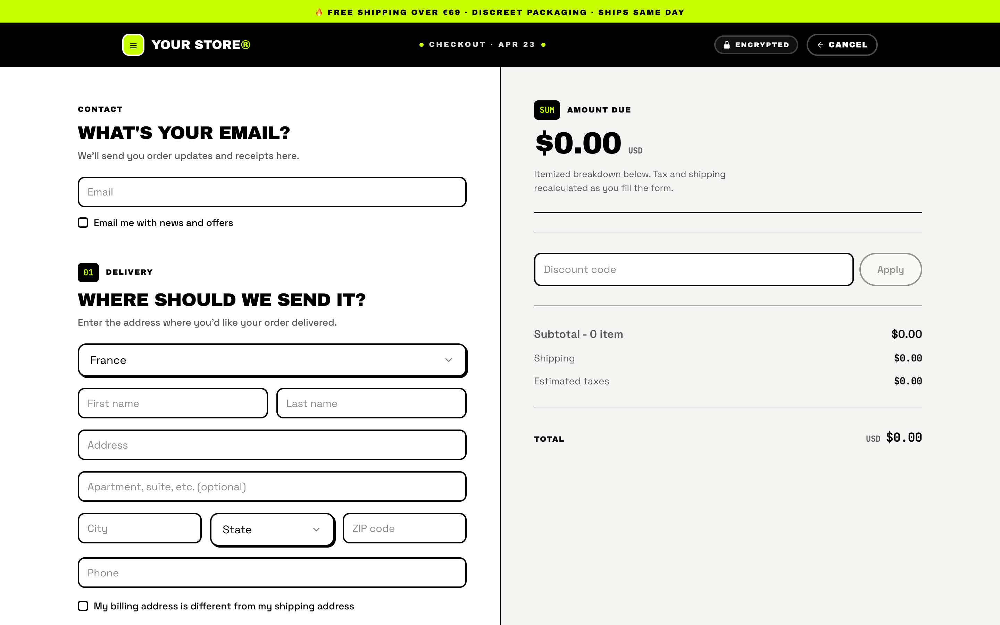
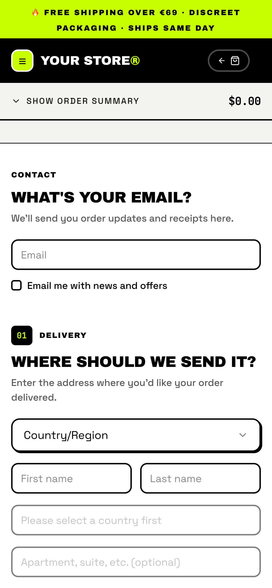

# Simple Checkout — Neon / Streetwear Style

A minimal, production-ready TagadaPay checkout plugin with a **loud
streetwear / neobrutalist** aesthetic. Built for CBD shops, streetwear
drops, skate brands, gaming merch, and any urban commerce brand whose
identity is confident, chromatic, and tactile.

> **Companion to** [`simple-checkout-style-editorial`](../simple-checkout-style-editorial).
> Same SDK hooks, same behavior, deliberately opposite vibe.
> Where editorial whispers, Neon shouts.

Both plugins share the exact same `@tagadapay/plugin-sdk` v2 hook surface
(`useCheckout`, `usePayment`, `useShippingRates`, `useFunnel`,
`useApplePayCheckout`, `useGooglePayCheckout`). Only the visual system
differs — which is the entire point: **one codebase, two brand worlds**.

---

## Showcase

<table>
  <tr>
    <td align="center" valign="top">
      
      <br/><sub>Desktop · 1440 × 900</sub>
    </td>
    <td align="center" valign="top">
      
      <br/><sub>Mobile · 390 × 844</sub>
    </td>
  </tr>
</table>

> Clean empty-state render with the default configuration — no theming applied.
> Run `pnpm dev` locally to see the full interactive experience.

---

## Aesthetic direction

Neobrutalist streetwear. Inspired by:

- **Palace, Supreme, Aimé Leon Dore** (streetwear energy)
- **Liquid Death** (loud CPG confidence)
- **Glossier early web** (tactile cosmetics)
- CBD / urban drop culture (acid colors, sticker-stack packaging)

The system in one line: **pure black ink on white surface, one acid-lime
neon scream, 2px borders everywhere, hard 3×3 drop shadows, pilled CTAs,
emoji welcome.**

### Three-color palette

| Role         | Color         | Usage                                             |
| ------------ | ------------- | ------------------------------------------------- |
| Ink / border | `#000000`     | Every border, every title, every frame           |
| Surface      | `#FFFFFF`     | Cards and primary backgrounds                    |
| Neon scream  | `#C8FF00`     | Primary CTA, selected states, promo stickers     |
| Hot-pink accent | `#FF2E88`  | Discount strike-through bars, danger indicators  |

### Typography

| Role    | Font            | Weight      |
| ------- | --------------- | ----------- |
| Display | Archivo Black   | 400 (single) |
| Body    | Space Grotesk   | 400 / 500 / 600 / 700 |
| Prices  | JetBrains Mono  | 500 / 700   |

All display headings are **UPPERCASE**, tight tracking, single weight —
the Archivo Black letterforms do all the work.

### Signature details

- **CTA**: fully-pilled (999px radius), lime fill, black text, 2px black
  border, hard `3×3 px` black drop shadow. On hover: nudges up-left and
  the shadow grows to `4×4`. Like pressing a sticker.
- **Step markers**: chunky black pill with neon-lime mono number
  (`01`, `02`, `03`).
- **Strike-through prices**: `2px` hot-pink bar through the old price,
  bold mono new price beside it.
- **Top bar**: solid black with an acid-lime free-shipping ticker strip
  on top; wordmark in uppercase Archivo Black with a lime "☰" monogram
  chip.
- **Motion**: only `80ms linear` nudges. No bounces. No eases. No blur.

---

## Project layout

```
simple-checkout-style-neon/
├── plugin.manifest.json       # Plugin metadata + routing
├── STYLE.md                   # Full design manifesto + anti-references
├── config/
│   └── default.config.json    # Neon-flavored defaults (acid-lime / black)
├── src/
│   ├── App.tsx                # Router: /checkout + /thankyou
│   ├── main.tsx
│   ├── index.css              # ⭐ Tokens + the chunky retrofit layer
│   ├── pages/CheckoutPage.tsx # Reads checkoutToken → renders <SingleStepCheckout/>
│   ├── components/
│   │   ├── SingleStepCheckout.tsx   # ⭐ The page — start here
│   │   ├── ThemeSetter.tsx           # 2px-black input/select/radio/checkbox
│   │   ├── TopBar.tsx                # Black masthead + lime ticker strip
│   │   ├── AddressSection.tsx
│   │   ├── OrderSummary.tsx
│   │   ├── PaymentSection.tsx
│   │   ├── ShippingRates.tsx
│   │   ├── OrderBump.tsx
│   │   ├── ExpressCheckoutButtons.tsx
│   │   └── ...                       # APM components (HiPay, Zelle, Whop, Custom)
│   ├── components/ui/
│   │   ├── button.tsx                # ⭐ The pilled streetwear CTA
│   │   ├── section-header.tsx        # ⭐ Chunky step-pill masthead
│   │   └── ...
│   ├── contexts/
│   ├── hooks/
│   ├── lib/
│   └── types/
└── README.md / STYLE.md
```

---

## How the style is built (single-file recap)

The trick to keeping this plugin a **tight visual fork** of the
editorial sibling without duplicating 30 component files:

1. **`src/index.css`** defines the three-color token system
   (`--neon-lime`, `--ink-900`, `--surface`) and replaces the fonts.
2. A **retrofit layer** at the bottom of `index.css` targets the
   arbitrary-value Tailwind class names that the editorial plugin
   sprinkled everywhere (`rounded-[4px] border border-[var(--line-strong)]`)
   and upgrades them globally:
   - 4px → 12px chunky radius
   - 1px → 2px black border
   - flat → hard `3×3 px` drop shadow
   - selected state: inset 1px → outer `3×3` shadow + `-1px` nudge
3. **Only four components** were rewritten (not just re-tokenized):
   `button.tsx`, `section-header.tsx`, `ThemeSetter.tsx`, `TopBar.tsx`.
   Everything else inherits the new look via the CSS retrofit.

Merchants can still override `primaryColor` via the plugin config — but
the fallback is acid lime, black is always ink, and the chunky geometry
is baked into `index.css`.

---

## Getting started

```bash
pnpm install
pnpm dev            # opens http://localhost:5173/checkout
```

Pass a checkout token via query string to hydrate a real session:

```
http://localhost:5173/checkout?checkoutToken=<TAGADA_CHECKOUT_TOKEN>
```

---

## Build & deploy

```bash
pnpm build
pnpm deploy          # or deploy:dev / deploy:staging / deploy:prod
```

---

## Where to look first

1. **`src/pages/CheckoutPage.tsx`** — resolving the checkout token from
   URL or funnel context.
2. **`src/components/SingleStepCheckout.tsx`** — the single source of
   truth for every SDK hook (`useCheckout`, `usePayment`,
   `useShippingRates`, `useFunnel`, `useApplePayCheckout`,
   `useGooglePayCheckout`, provider-specific handoffs).
3. **`src/index.css`** + **`src/components/ThemeSetter.tsx`** — how the
   tokens and retrofit layer create the streetwear look on top of the
   shared component library.
4. **`STYLE.md`** — design manifesto, brand references, anti-patterns.

---

## Pair it with the editorial plugin

Ship both in the same account and let merchants pick the vibe that
matches their brand. Same backend behavior, zero retraining.

```
simple-checkout-style-editorial/   # Swiss-modern, olive-bronze, magazine
simple-checkout-style-neon/        # streetwear, acid lime, neobrutalist
```

---

## License

MIT — see the parent repository root for the license file.
