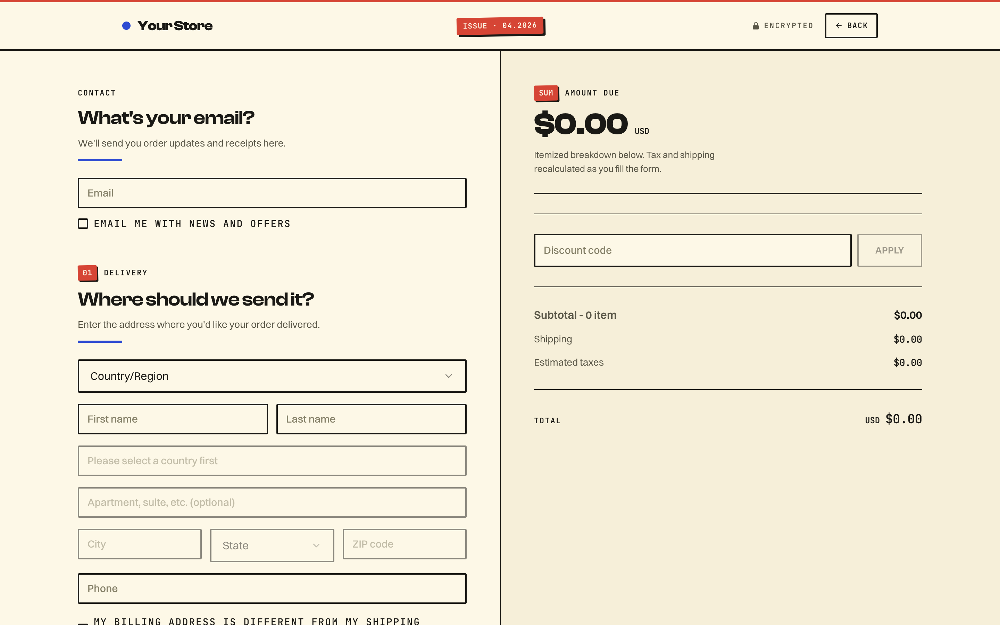
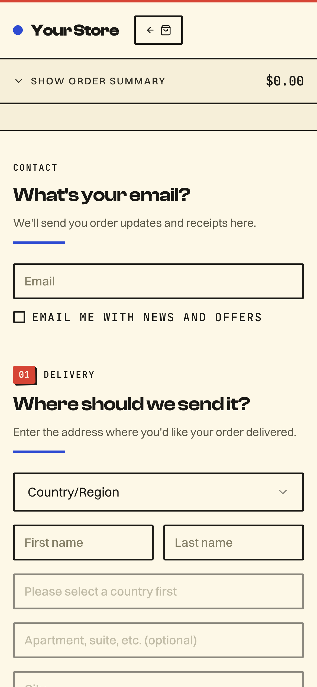
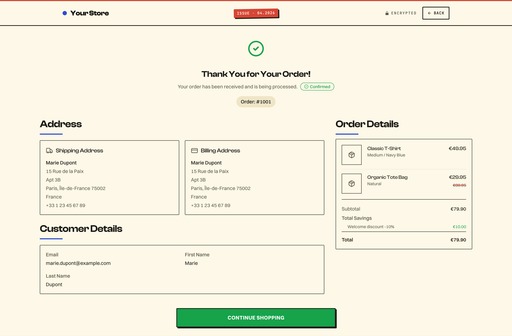
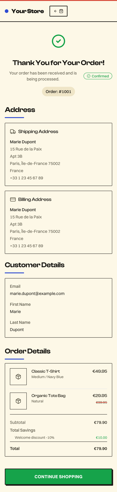

# Simple Checkout — Solar / Zine Style

A minimal, production-ready TagadaPay checkout plugin with a
**risograph / sun-bleached zine** aesthetic. Built for indie
food, beverage, candles, soap, small-batch apparel, and any
commerce brand whose identity is handmade, playful, and confident.

> **Sibling of** [`simple-checkout-style-editorial`](../simple-checkout-style-editorial),
> [`simple-checkout-style-luxe`](../simple-checkout-style-luxe),
> [`simple-checkout-style-neon`](../simple-checkout-style-neon).
> Same SDK hooks, same behavior — different brand world.

All variants share the exact same `@tagadapay/plugin-sdk` v2 hook
surface. Only the visual system differs — that's the entire point:
**one codebase, many brand worlds**.

---

## Showcase

<table>
  <thead>
    <tr>
      <th align="center">Desktop · 1440 × 900</th>
      <th align="center">Mobile · 390 × 844</th>
    </tr>
  </thead>
  <tbody>
    <tr>
      <td align="center" valign="top">
        
        <br/><sub>Checkout</sub>
      </td>
      <td align="center" valign="top">
        
        <br/><sub>Checkout</sub>
      </td>
    </tr>
    <tr>
      <td align="center" valign="top">
        
        <br/><sub>Thank-you · full page</sub>
      </td>
      <td align="center" valign="top">
        
        <br/><sub>Thank-you · full page</sub>
      </td>
    </tr>
  </tbody>
</table>

> Clean empty-state render with the default configuration — no theming applied.
> Run `pnpm dev` locally to see the full interactive experience.

---

## Aesthetic direction

Risograph / zine. Inspired by:

- Risograph print shops (tomato-red + cobalt-blue two-pass limits)
- Farmers-market hand-painted signs
- Indie food brands (Fly By Jing, Omsom, Graza, Fishwife)
- Good Magazine / Apartamento (cream paper, display serif)

The system in one line: **sun-bleached cream surface, tomato-red
stamps for CTA and promo, cobalt ink for secondary marks, 2px
charcoal rules, no gradients, slight rotation on accent tags.**

### Palette

| Role       | Color     | Usage                                              |
| ---------- | --------- | -------------------------------------------------- |
| Type       | `#1A1915` | Charcoal — all body + heading text                 |
| Surface    | `#F6EFD9` | Page background (sun-bleached cream)               |
| Paper      | `#FDF8E7` | Card surface (brighter cream)                      |
| Primary    | `#D64535` | Tomato stamp — CTA, step markers, promo            |
| Secondary  | `#2E4BD2` | Cobalt — links, selected chips, accent rules       |
| Tertiary   | `#727339` | Olive — ornamental tags (rare)                     |
| Rule       | `#1A1915` | All thick 2px rules are pure charcoal              |

### Typography

| Role    | Font             | Weight          |
| ------- | ---------------- | --------------- |
| Display | Clash Display    | 600 / 700       |
| Body    | Switzer          | 400 / 500 / 600 |
| Prices  | JetBrains Mono   | 500 / 600 / 700 |

Display is chunky + confident (Clash Display). Body is silent
(Switzer). Every eyebrow / label / number is mono — that's the
typewriter-zine DNA.

### Signature details

- **CTA**: tomato-red fill, cream label, 2px charcoal border, 3×3
  charcoal stamp shadow. On hover: slides -1px up-left, shadow
  grows to 4×4. Feels like pressing a linocut into ink.
- **Step markers**: rotated tomato-red stamp (-1°) with cream
  mono number. Signature zine misalignment.
- **Section titles**: Clash Display + a 3px cobalt underline that
  doubles as the section bar.
- **Top bar**: cream surface, 3px tomato stripe on top, cobalt dot
  next to the wordmark, "ISSUE · MM.YYYY" stamp centered.
- **Stamps**: rotatable `.stamp` utility (`--tomato-500` / cobalt /
  olive) with 3×3 charcoal shadow — for promo/scarcity/trust chips.
- **Motion**: 100ms linear — quick, flip-the-page energy.

---

## Project layout

```
simple-checkout-style-solar/
├── plugin.manifest.json       # Plugin metadata + routing
├── STYLE.md                   # Full design manifesto
├── .impeccable.md             # Impeccable design context
├── config/
│   └── default.config.json    # Zine defaults (tomato / cream / charcoal)
├── src/
│   ├── App.tsx                # Router: /checkout + /thankyou
│   ├── main.tsx
│   ├── index.css              # ⭐ Tokens + zine retrofit layer
│   ├── pages/CheckoutPage.tsx
│   ├── components/
│   │   ├── SingleStepCheckout.tsx   # ⭐ The page — start here
│   │   ├── ThemeSetter.tsx           # 2px charcoal form controls
│   │   ├── TopBar.tsx                # Cream bar + tomato stripe
│   │   └── ...                       # Shared checkout components
│   ├── components/ui/
│   │   ├── button.tsx                # ⭐ The tomato stamp CTA
│   │   ├── section-header.tsx        # ⭐ Rotated stamp + cobalt rule
│   │   └── ...
│   ├── contexts/
│   ├── hooks/
│   ├── lib/
│   └── types/
└── README.md / STYLE.md
```

---

## Getting started

```bash
pnpm install
pnpm dev            # opens http://localhost:5173/checkout
```

Pass a checkout token via query string:

```
http://localhost:5173/checkout?checkoutToken=<TAGADA_CHECKOUT_TOKEN>
```

---

## Build & deploy

```bash
pnpm build
pnpm deploy          # or deploy:dev / deploy:staging / deploy:prod
```

---

## Pair it with sibling plugins

```
simple-checkout-style-editorial/   # Swiss-modern, olive-bronze, magazine
simple-checkout-style-neon/        # streetwear, acid lime, neobrutalist
simple-checkout-style-luxe/        # boutique, forest + gold, atelier
simple-checkout-style-solar/       # zine, cream + tomato + cobalt, indie
simple-checkout-style-arcade/      # Y2K, lavender + peach + electric blue
```

---

## License

MIT — see the parent repository root for the license file.
